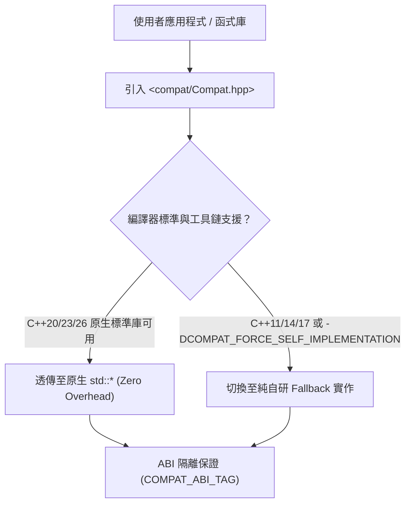

# CPP-Compat API 參考手冊 (API Reference Manual)

歡迎查閱 **CPP-Compat** 官方 API 規格與技術參考手冊。  
本手冊以 **Microsoft Learn (MSDN)** 與 **C++ cppreference.com** 的標準結構編寫，詳盡列出各模組、類別、函式、概念（Concepts）與自訂點物件（Customization Point Objects, CPO）的規格合約、例外保證、複雜度與範例程式碼。

---

## 模組與標頭檔索引 (Modules & Headers Index)

CPP-Compat 採完全解耦與模組化設計。您可以包含總括標頭 `<compat/Compat.hpp>`，或依需求引入特定功能子標頭：

| 模組文件 | 主要標頭檔 | 所屬命名空間 | 核心型別 / 函式 / 特性摘要 | ISO 對齊標準 |
| :--- | :--- | :--- | :--- | :---: |
| [**特性檢測與配置 (Config)**](config.md) | `<compat/Config.hpp>` | `compat`, `compat::detail` | 標準方言常數、特性檢測巨集、雙軌切換開關、Failure Policy Invariant (無例外安全終止)、全平臺編譯矩陣 | C++11 ~ C++26 |
| [**字串檢視 (String View)**](string_view.md) | `<compat/StringView.hpp>` | `compat` | `compat::string_view`, `std::hash<compat::string_view>` | C++17 |
| [**選擇性值 (Optional)**](optional.md) | `<compat/Optional.hpp>` | `compat` | `optional<T>`, `nullopt`, `bad_optional_access`, `make_optional`, `reset()`, `emplace()`, C++11 特殊成員傳遞 | C++17 |
| [**期望值與錯誤處理 (Expected)**](expected.md) | `<compat/Expected.hpp>` | `compat` | `expected<T, E>`, `expected<void, E>`, `unexpected<E>`, `bad_expected_access`, Monadic 操作, Lifetime Invariant (三種例外安全轉移策略) | C++23 |
| [**格式化輸出 (Format)**](format.md) | `<compat/Format.hpp>` | `compat` | `format`, `formatter<T>` 自訂擴充, 標準格式規格語法 (`[[fill]align][sign][#][0][width][.precision][type]`), 自動/手動索引表, 浮點預設完整精度 (%.17g), 大精度防溢位緩衝, Unicode 東亞寬度 (UAX #11 / P1868R2) | C++20 |
| [**終端列印 (Print)**](print.md) | `<compat/Print.hpp>` | `compat` | `print`, `println`, `std::ostream&` 串流路由, Windows UTF-8 `WriteConsoleW` 直寫, 東亞多欄排版對齊, 換行重載 | C++23 |
| [**強型別解析 (Parse)**](parse.md) | `<compat/Parse.hpp>` | `compat` | `parse<T>`, `from_chars`（整數 2~36 進位、IEEE 754 次常態數 1e-320、下溢 out_of_range、失敗時輸出引數絕不被修改） | C++17 |
| [**範圍基礎與概念 (Ranges)**](ranges.md) | `<compat/Ranges.hpp>` | `compat::ranges` | Range Concepts, CPO (`begin`, `end`, `size` 等), `subrange`, `dangling`, `single_view` 生命週期安全約束, `ranges::to` (C++23) | C++20 / C++23 / C++26 |
| [**視圖適配器 (Views)**](views.md) | `<compat/View.hpp>` | `compat::views` | 管道運算子 (`\|`), C++20 核心視圖 (`iota`, `filter`, `transform` 等), C++23/26 視圖 (`as_const`, `cache_latest`, `concat`) | C++20 / C++23 / C++26 |
| [**受約束範圍演算法 (Algorithms)**](algorithms.md) | `<compat/Algorithm.hpp>` | `compat::ranges` | Niebloid 函式物件, 投影 (`compat::identity`, 成員指標), 標籤結果型別 (`in_out_result` 等), 全 11 大類演算法家族 (42+ 新演算法) | C++20 / C++23 / C++26 |
| [**未初始化記憶體 (Memory)**](memory.md) | `<compat/Memory.hpp>` | `compat::ranges` | `construct_at`, `destroy_at`, `destroy`, `uninitialized_copy/fill/move/construct`, RAII 回滾安全防護 | C++20 |

---

## 雙軌架構原則 (Dual-Track Architecture)

CPP-Compat 具備業界最高標準的雙軌執行模式：

1. **原生零開銷透傳 (Transparent Native Routing)**：  
   當在現代編譯器（如 MSVC 19+、GCC 11+、Clang 14+）下編譯，且開啟相應語言標準（如 `/std:c++20`、`-std=c++23`、`-std=c++26`）時，各型別均透明別名（Type Alias）至 `std::*`，完全享有現代編譯器的內聯、向量化與內建最佳化。

2. **自給自足降階實作 (Self-Contained Fallback)**：  
   當在 C++11/14/17 舊環境編譯，或使用者顯式指定 `-DCOMPAT_FORCE_SELF_IMPLEMENTATION=ON` 時，自動啟用純自研、零第三方相依的輕量實作，保證**語意 100% 對齊 ISO 標準規格**。

3. **ABI 隔離與 ODR 防護**：  
   Fallback 命名空間內置 `COMPAT_ABI_TAG`（如 `abi_v1`）內聯命名空間，徹底杜絕跨編譯單元混用時的單一定義規則（One Definition Rule, ODR）衝突與符號混淆。

---

## 規範合約與保證 (Contracts & Guarantees)

- **零外部依賴 (Zero External Dependencies)**：僅依賴 ISO C++ 標準庫最基礎頭檔（如 `<cstddef>`, `<cstdint>`, `<utility>`, `<type_traits>`），不拉取任何第三方套件。
- **純函數設計 (Fail-Fast & Constexpr)**：公開 API 大量採用 `[[nodiscard]]`、`noexcept`、`constexpr` / `COMPAT_CONSTEXPR_14` 修飾。
- **無例外環境相容 (`-fno-exceptions`)**：透過 `COMPAT_THROW_OR_ABORT` 巨集，在關閉例外的嵌入式或高頻交易環境中自動降階為 `std::abort()`，杜絕未捕獲異常。
- **UTF-8 BOM 編碼**：全標頭檔與原始碼均符合 Windows / MSVC / GCC / Clang 共通之 UTF-8 BOM 規範。
