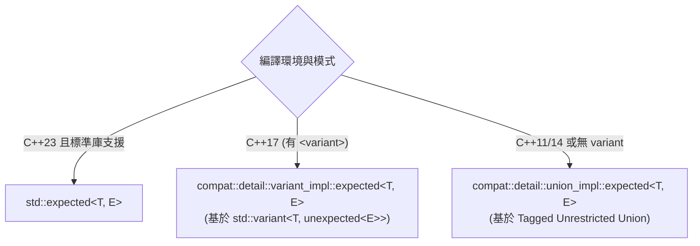
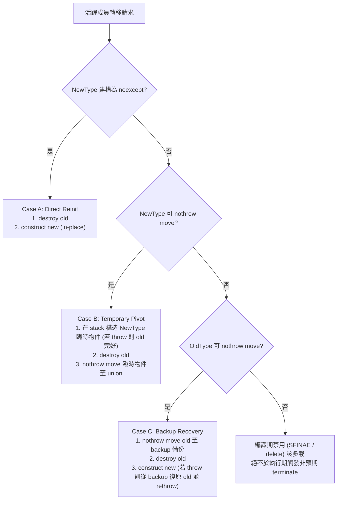

# 期望值與錯誤處理 (compat::expected)

定義於標頭檔 [`<compat/Expected.hpp>`](file:///D:/program/C++/CPP-Compat/include/compat/Expected.hpp)。  
所屬命名空間：`compat`。

`compat::expected<T, E>` 是一個詞彙型別（Vocabulary Type），封裝了運算成功產生的預期數值（型別 `T`）或失敗時攜帶的非預期錯誤值（型別 `E`）。它完全遵循 **ISO C++23 `std::expected`** 標準合約，支援 Monadic Operations，旨在取代 C 風格錯誤碼與 C++ 例外處理，落實純函數、型別安全且零額外記憶體配置的錯誤傳遞架構。

---

## 類別樣板宣告 (Declaration)

```cpp
namespace compat {
    // 成功值標籤與錯誤值容器
    template <typename E>
    class unexpected;

    // 異常存取例外物件
    template <typename E>
    class bad_expected_access;

    // 基礎 expected 類別
    template <typename T, typename E>
    class expected;

    // void 特化版（無成功回傳值）
    template <typename E>
    class expected<void, E>;
}
```

---

## 底層儲存架構與相容性分流 (Storage Architectures)



1. **Native C++23 模式**：直接別名 `std::expected`、`std::unexpected`、`std::bad_expected_access`。
2. **C++17 Variant Fallback**：透過 `std::variant` 實作，自動享有現代 STL 的例外保證與移動語意。
3. **C++11/14 Tagged Union Fallback**：  
   純自研**無限制聯合體（Unrestricted Union）**。當 `T` 與 `E` 均為 Trivial 類型時，自研 `expected` 亦自動成為 Trivial 類型，並透過精確的顯式解構式呼叫管理非平凡（Non-trivial）型別的生命週期。

---

## 核心生命週期不變量 (Lifetime & State Invariant)

`compat::expected<T, E>` 保證永遠處於合法狀態：
- 在任何成功運算或例外傳播後，物件**必須持有有效 `T` 或有效 `E`**。
- **杜絕任何第三種狀態**：不存在 `valueless_by_exception` 或未初始化活躍狀態（uninitialized-active-state）。

### 活躍成員例外安全轉移策略 (`reinit_expected`)

在自研 Union 儲存架構中，跨成員切換（`value -> error` 或 `error -> value`）由統一原語集中控制，嚴格遵循三種例外安全分派策略：



- **Case A (直接重建)**：當目標型別建構保證 `noexcept`，直接銷毀舊物件並就地建構新物件。
- **Case B (臨時物件過渡)**：若新物件建構可能拋出例外但支援 `nothrow move`，先於 stack 建構臨時物件。若拋出例外，舊物件保持完好無損；成功後再銷毀舊物件並將臨時物件遷入儲存區。
- **Case C (舊成員備份復原)**：若新物件移動可能拋出例外，但舊物件支援 `nothrow move`，先將舊物件遷出至 backup。若新物件建構拋出例外，立即從 backup 復原舊物件後重新拋出例外。

### 條件式 `noexcept` 與特殊成員 SFINAE

- **特殊成員函式禁用**：若 `T` 或 `E` 不支援複製建構/賦值，對應之 `expected<T, E>` 複製成員函式在編譯期被 SFINAE 刪除。
- **精確條件式 `noexcept`**：複製/移動建構與賦值運算子均帶有 `noexcept(...)` 條件式推導，僅在包含之型別確實 `nothrow` 時成立，避免 throwing 型別在例外傳播中誤入 `std::terminate`。

---

## 成員型別 (Member Types)

| 成員型別 | 定義 |
| :--- | :--- |
| `value_type` | `T`（在 `expected<void, E>` 中為 `void`） |
| `error_type` | `E` |
| `unexpected_type` | `compat::unexpected<E>` |
| `template <typename U> rebind<U>` | `compat::expected<U, E>` |

---

## 成員函式 (Member Functions)

### 觀察者 (Observers)

| 函式 | 簽章 | 說明與例外保證 |
| :--- | :--- | :--- |
| `has_value` | `constexpr bool has_value() const noexcept;` | 檢查物件當前是否包含預期成功值。 |
| `operator bool` | `constexpr explicit operator bool() const noexcept;` | 等價於 `has_value()`。 |
| `value()` | `constexpr T& value() &;`<br>`constexpr const T& value() const &;`<br>`constexpr T&& value() &&;`<br>`constexpr const T&& value() const &&;` | 存取成功值。若為錯誤狀態，拋出 `bad_expected_access<E>(error())`（或呼叫 `COMPAT_THROW_OR_ABORT`）。 |
| `operator*()` | `constexpr T& operator*() & noexcept;`<br>`constexpr const T& operator*() const & noexcept;` | 解參考取得成功值。若為錯誤狀態，行為未定義（零檢查開銷）。 |
| `operator->()` | `constexpr T* operator->() noexcept;`<br>`constexpr const T* operator->() const noexcept;` | 箭頭運算子存取成功值指標。 |
| `error()` | `constexpr E& error() & noexcept;`<br>`constexpr const E& error() const & noexcept;`<br>`constexpr E&& error() && noexcept;` | 存取錯誤值。呼叫前必須確保 `!has_value()`。 |
| `value_or(U&& default_value)` | `constexpr T value_or(U&& default_value) const&;` | 若有值回傳該值，否則回傳預設值。 |
| `error_or(G&& default_error)` | `constexpr E error_or(G&& default_error) const&;` | 若為錯誤回傳錯誤值，否則回傳預設錯誤。 |

### 修飾者與就地建構 (Modifiers)

| 函式 | 簽章 | 說明與例外保證 |
| :--- | :--- | :--- |
| `emplace(Args&&... args)` | `template <typename... Args>`<br>`constexpr T& emplace(Args&&... args);` | 就地直接建構包含之預期值。若當前持有錯誤，銷毀錯誤並轉移為成功狀態。提供強例外安全保證（Strong Exception Safety），底層絕不進入 `valueless_by_exception`。回傳建構之數值參考。 |
| `emplace(il, Args&&... args)` | `template <typename U, typename... Args>`<br>`constexpr T& emplace(std::initializer_list<U> il, Args&&... args);` | 透過 `std::initializer_list` 與轉發引數就地直接建構預期值。回傳建構之數值參考。 |
| `emplace()`<br>*(針對 `expected<void, E>`)* | `constexpr void emplace() noexcept;` | 將 `expected<void, E>` 重設為成功狀態，銷毀既有錯誤值（若有）。保證 `noexcept`。 |

> [!TIP]
> **`emplace()` 概念約束與測試規範 (ISO C++23 對齊)**  
> 依據 C++23 標準，`expected<T, E>::emplace` 要求目標型別滿足 `std::is_nothrow_constructible_v<T, Args...>` 或 `std::is_nothrow_move_constructible_v<T>` 約束。在撰寫自訂型別生命週期追蹤器（如 `LifetimeCounter`）或測試案例時，建議將建構子適當標記為 `noexcept`，以順利通過嚴格標準庫之概念約束檢查。

---

## 鏈式單子操作 (Monadic Operations)

符合現代函式語言風格，避免層層巢狀 `if (!res)` 檢查：

### 1. `and_then`
```cpp
template <typename F>
constexpr auto and_then(F&& f) & -> /* 返回 f(*this) 的 expected */;
```
- **語意**：當前有值時，將數值傳入函式 `f`（`f` 必須回傳另一個 `expected`）；若當前為錯誤狀態，直接轉發當前錯誤，短路執行。

### 2. `transform`
```cpp
template <typename F>
constexpr auto transform(F&& f) & -> /* 返回包含 f(*this) 的 expected */;
```
- **語意**：當前有值時，將數值經由 `f` 轉換並重新包裝入 `expected`；若為錯誤直接轉發。

### 3. `or_else`
```cpp
template <typename F>
constexpr auto or_else(F&& f) & -> /* 錯誤修復回傳 */;
```
- **語意**：當前為錯誤狀態時，將錯誤傳入 `f` 進行補救或重新包裝；若當前有值則直接轉發數值。

### 4. `transform_error`
```cpp
template <typename F>
constexpr auto transform_error(F&& f) & -> /* 轉換錯誤型別 */;
```
- **語意**：當前為錯誤狀態時，將錯誤值傳入 `f` 轉換為新型別的錯誤並包裝；若當前有值則直接轉發數值。

---

## `expected<void, E>` 特化規格

當函式僅代表成功執行完畢，不需要回傳數值時，使用 `expected<void, E>`：
- 建構式支援預設建構 `expected<void, E>()` 表示成功。
- `value()` 回傳 `void`。若為錯誤狀態則拋出異常或終止。
- `operator*()` 僅作為語法斷言，回傳 `void`。
- `emplace()` 重設為成功狀態，銷毀既有錯誤值（若有），保證 `noexcept`。

---

## 範例程式碼 (Example)

```cpp
#include <compat/Expected.hpp>
#include <iostream>
#include <string>

// 1. 回傳 expected<T, E> 的安全函式
compat::expected<int, std::string> ParsePositive(int val) {
    if (val <= 0) {
        return compat::unexpected<std::string>("Value must be strictly positive");
    }
    return val;
}

// 2. 回傳 expected<void, E> 的驗證函式
compat::expected<void, std::string> ValidateMax(int val) {
    if (val > 100) {
        return compat::unexpected<std::string>("Value exceeds maximum limit of 100");
    }
    return {};
}

int main() {
    // 成功單子鏈
    auto result = ParsePositive(42)
        .and_then([](int v) -> compat::expected<int, std::string> {
            return v * 2;
        })
        .transform([](int v) {
            return v + 10;
        });

    if (result) {
        std::cout << "Success Pipeline: " << *result << "\n"; // 94
    }

    // 失敗鏈與 or_else 救援
    auto fallback = ParsePositive(-5)
        .or_else([](const std::string& err) -> compat::expected<int, std::string> {
            std::cout << "Caught error: [" << err << "], applying fallback...\n";
            return 1; // 補救值
        });

    std::cout << "Recovered Value: " << fallback.value() << "\n"; // 1

    return 0;
}
```

---

## 參閱 (See Also)
- [API 參考首頁](README.md)
- [強型別解析 (Parse)](parse.md)
- [特性檢測與配置 (Config)](config.md)
