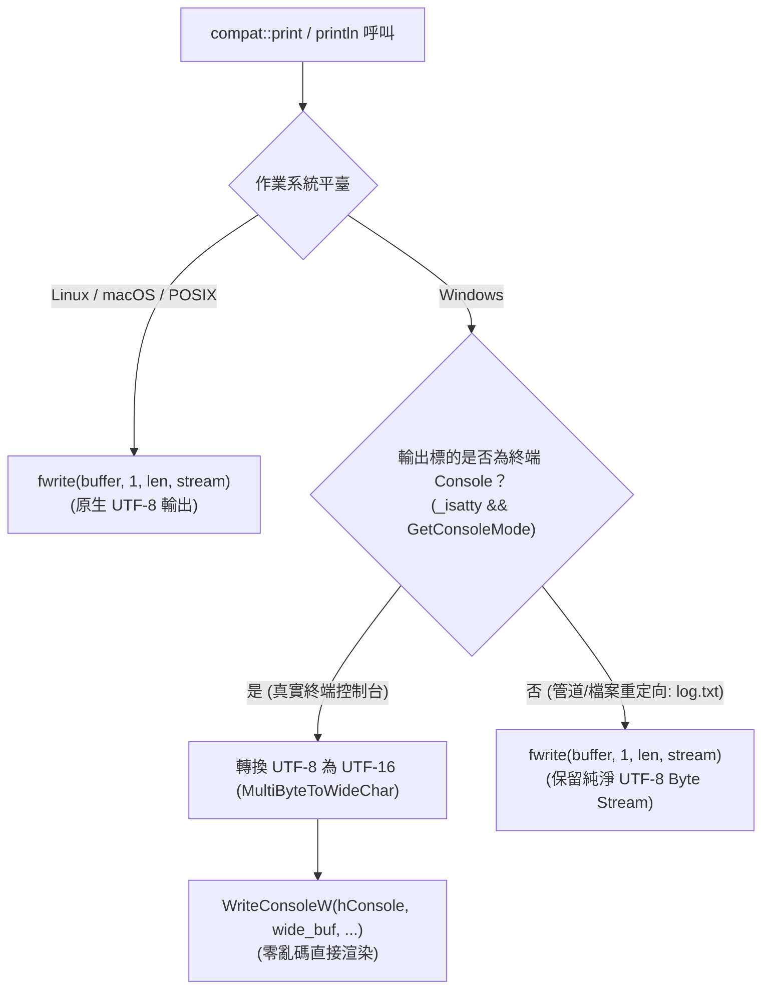

# 終端列印 (compat::print / println)

定義於標頭檔 [`<compat/Print.hpp>`](file:///D:/program/C++/CPP-Compat/include/compat/Print.hpp)。  
所屬命名空間：`compat`。

`compat::print` 與 `compat::println` 完全遵循 **ISO C++23 `std::print` 與 `std::println`** 標準規格。提供極速、型別安全且自動處理 Unicode 編碼的控制台與串流輸出能力。  
在 Windows 平台上，它透過自研的 UTF-8 直寫通道直接調用 Win32 `WriteConsoleW` API，徹底終結了 Windows 終端長久以來的亂碼（Mojibake）問題，**完全無需**侵入性修改全域 Code Page（如 `SetConsoleOutputCP(65001)`）。同時完整支援 ISO C++20 格式化規格語法與 Unicode 東亞寬度 (UAX #11) 終端多欄排版。

---

## 函式樣板宣告 (Declaration)

```cpp
namespace compat {

    // ==========================================
    // 1. 標準輸出 (stdout)
    // ==========================================

    /// <summary>
    /// 格式化文字並寫入標準輸出 stdout (不換行)。
    /// </summary>
    template <typename... Args>
    void print(compat::string_view fmt, const Args&... args);

    /// <summary>
    /// 格式化文字並寫入標準輸出 stdout，結尾自動追加換行符 '\n'。
    /// </summary>
    template <typename... Args>
    void println(compat::string_view fmt, const Args&... args);

    /// <summary>
    /// 輸出單一換行符 '\n' 至標準輸出 stdout。
    /// </summary>
    void println();


    // ==========================================
    // 2. 指定 C 檔案串流 (FILE* stream)
    // ==========================================

    /// <summary>
    /// 格式化文字並寫入指定 C 檔案串流（如 stdout 或 stderr）。
    /// </summary>
    template <typename... Args>
    void print(std::FILE* stream, compat::string_view fmt, const Args&... args);

    /// <summary>
    /// 格式化文字並寫入指定 C 檔案串流，結尾追加換行符 '\n'。
    /// </summary>
    template <typename... Args>
    void println(std::FILE* stream, compat::string_view fmt, const Args&... args);

    /// <summary>
    /// 輸出單一換行符 '\n' 至指定 C 檔案串流。
    /// </summary>
    void println(std::FILE* stream);


    // ==========================================
    // 3. C++ 輸出串流 (std::ostream)
    // ==========================================

    /// <summary>
    /// 格式化文字並寫入指定 std::ostream 串流（支援 std::cout, std::cerr, std::ostringstream 等）。
    /// 若目標為 std::cout 或 std::cerr，在 Windows 上將自動轉入 UTF-8 直寫管線防止亂碼。
    /// </summary>
    template <typename... Args>
    void print(std::ostream& os, compat::string_view fmt, const Args&... args);

    /// <summary>
    /// 格式化文字並寫入指定 std::ostream 串流，結尾追加換行符 '\n'。
    /// </summary>
    template <typename... Args>
    void println(std::ostream& os, compat::string_view fmt, const Args&... args);

    /// <summary>
    /// 輸出單一換行符 '\n' 至指定 std::ostream 串流。
    /// </summary>
    void println(std::ostream& os);

} // namespace compat
```

---

## 核心架構：Windows Unicode 直寫管線 (Windows Terminal Architecture)

在傳統 C++ 中，於 Windows 終端印出 UTF-8 多國語言（中文、日文、Emoji 等）極易發生亂碼，或因管道重定向導致輸出損壞。`compat::print` 採用以下狀態機處理：



### 技術優勢
1. **無全域副作用**：不呼叫 `SetConsoleOutputCP(65001)`，不影響同行程內依賴當前 ANSI Code Page 的其他模組或第三方函式庫。
2. **自動探測重定向**：當輸出被重定向至檔案（如 `app.exe > log.txt`）或 CI/CD 管道時，自動切換至純 Byte Stream 寫入，保證輸出檔案內容為合法的 UTF-8，不插入額外的寬字元編碼。
3. **`std::ostream` 路由防護**：傳入 `std::cout`、`std::cerr` 時自動攔截並轉至 UTF-8 直寫管線，確保標準 C++ 串流也能享有完美的 Unicode 渲染。

---

## 格式化規格與 Unicode 東亞多欄排版 (Format Spec & Column Alignment)

`compat::print` / `compat::println` 完全繼承並整合了 [`compat::format`](format.md) 的強大格式化規格引擎：
- 支援完整語法：`[[fill]align][sign][#][0][width][.precision][type]`
- 實作 **Unicode UAX #11 (East Asian Width)** 與 **P1868R2** 終端估計欄位寬度（Display Columns）：
  - 西文字元：佔 1 欄位。
  - CJK 漢字、日韓字元、全形符號、Emoji：佔 2 欄位。

### 表格化對齊範例
```cpp
// 每個中文字（全形）佔 2 個終端字元欄位，「一號」佔 4 欄寬。
// 設定寬度 8 時，演算法自動補入 4 個空白，實現完美的終端表格多欄對齊：
compat::println("{:8}{:8}{:8}{:8}", "一號", "二號", "三號", "四號");
compat::println("{:8}{:8}{:8}{:8}", "A-1", "B-2", "C-3", "D-4");
```
終端輸出效果：
```
一號    二號    三號    四號    
A-1     B-2     C-3     D-4     
```

---

## 範例程式碼 (Example)

### 1. 標準輸出與格式化規格

```cpp
#include <compat/Print.hpp>

int main() {
    // 基本列印與自動換行
    compat::println("Hello, {}!", "CPP-Compat");

    // 寬度、對齊與前導零
    compat::println("[{:8}] [{:<8}] [{:08d}]", 42, 42, 42);
    // 輸出: [      42] [42      ] [00000042]

    // 十六進位前綴與大寫
    compat::println("Address: {:#010x}, Color: #{:06X}", 0x7fa0, 0xff8800);
    // 輸出: Address: 0x00007fa0, Color: #FF8800

    // 單純輸出換行
    compat::println();

    return 0;
}
```

### 2. 多國語言、Emoji 與 Windows 控制台零亂碼

```cpp
#include <compat/Print.hpp>

int main() {
    compat::println("繁體中文測試: 現代 C++ 控制台格式化 🚀");
    compat::println("日本語テスト: こんにちは世界 🌸");
    compat::println("Accents: Déjà vu, façade, naïve, café ☕");
    compat::println("Math & Box: ∀x∈ℝ, ┌─┐ └─┘ ∑ ∏");
    return 0;
}
```

### 3. C 檔案串流 (stderr) 與 C++ 輸出串流 (std::ostream)

```cpp
#include <compat/Print.hpp>
#include <sstream>
#include <iostream>

int main() {
    // 寫入 stderr 錯誤串流
    compat::println(stderr, "[ERROR] Task failed with code: {:#x}", 0x80004005);

    // 寫入 std::cout（Windows 自動防止亂碼）
    compat::println(std::cout, "透過 std::cout 輸出繁體中文: 🌟");

    // 寫入 std::ostringstream 記憶體串流
    std::ostringstream oss;
    compat::print(oss, "{:8} = {:04d}", "Result", 7);
    std::cout << "OSS: [" << oss.str() << "]\n";
    // 輸出: OSS: [Result   = 0007]

    return 0;
}
```

---

## 參閱 (See Also)

- [API 參考首頁](README.md)
- [格式化輸出 (Format)](format.md)
- [字串檢視 (String View)](string_view.md)
- [強型別解析 (Parse)](parse.md)
