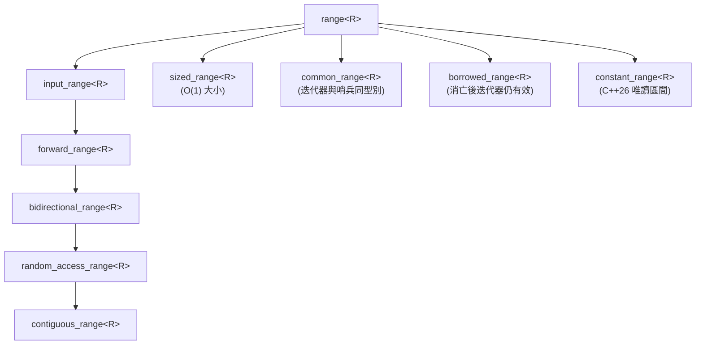

# 範圍基礎與概念 (compat::ranges)

定義於標頭檔 [`<compat/Ranges.hpp>`](file:///D:/program/C++/CPP-Compat/include/compat/Ranges.hpp)。  
所屬命名空間：`compat::ranges`。

`compat::ranges` 提供完備的現代 C++ Range 概念體系、型別特徵萃取器（Type Traits）、自訂點物件（Customization Point Objects, CPO）以及通用子範圍包裝器 `subrange`。  
在支援 C++20 的編譯器下透明對齊 `std::ranges`；在舊版 C++11/14/17 環境下，透過 SFINAE 與萃取器模板完整模擬 Concepts，提供強大的泛型約束與安全保證。

---

## 範圍概念體系 (Range Concepts / Traits)

在 C++20 環境下為 Concept，在 C++11/14/17 環境下為 `std::integral_constant<bool, ...>` 結構體特徵萃取器：



| 概念名稱 | 語意與合約要求 |
| :--- | :--- |
| `range<R>` | 可以呼叫 `ranges::begin(r)` 與 `ranges::end(r)` 取得迭代器與哨兵。 |
| `sized_range<R>` | 可以在 $O(1)$ 時間內透過 `ranges::size(r)` 取得元素總數。 |
| `common_range<R>` | 其 `begin` 與 `end` 具有相同的迭代器型別（相容舊式 C++ 迭代器對）。 |
| `input_range<R>` | 滿足至少單次掃描輸入迭代器合約。 |
| `forward_range<R>` | 滿足多次掃描前向迭代器合約。 |
| `bidirectional_range<R>` | 滿足雙向移動迭代器合約（支援 `--it`）。 |
| `random_access_range<R>` | 滿足隨機存取迭代器合約（支援 `it + n`、`it[n]`，均為 $O(1)$）。 |
| `contiguous_range<R>` | 元素在記憶體中連續儲存（可透過 `ranges::data(r)` 取得實體指標）。 |
| `borrowed_range<R>` | 當 R 為右值臨時物件時，自其取得的迭代器不會懸空（如 `std::string_view` 或 `subrange`）。 |
| `constant_range<R>` | **ISO C++26 (P2728R6)**：迭代器解參考回傳唯讀 const 參考。 |
| `sentinel_for<S, I>` | **ISO C++20**：指定型別 S 是迭代器型別 I 的哨兵（可透過 `it == s` 與 `it != s` 比較）。 |
| `sized_sentinel_for<S, I>` | **ISO C++20**：指定哨兵 S 與迭代器 I 支援常數時間差值計算（`s - it` 與 `it - s`）。 |

---

## 關聯型別萃取器 (Associated Type Traits)

```cpp
template <typename R> using iterator_t        = /* ranges::begin 回傳型別 */;
template <typename R> using sentinel_t        = /* ranges::end 回傳型別 */;
template <typename R> using range_value_t     = typename std::iterator_traits<iterator_t<R>>::value_type;
template <typename R> using range_reference_t = decltype(*std::declval<iterator_t<R>&>());
template <typename R> using range_difference_t= typename std::iterator_traits<iterator_t<R>>::difference_type;
template <typename R> using range_rvalue_reference_t = /* 右值參考 */;
```

---

## 範圍轉換函式與標記 (ISO C++23: `ranges::to` & `from_range`)

### 1. `compat::ranges::to<C>(r, [args...])`
將任意 Range 物件直接轉換、蒐集並構造為指定容器：
- **容器建構優先序**：
  1. 若容器支援 `C(from_range, r, args...)` 則優先呼叫（ISO C++23 Range 建構式）。
  2. 若為 `common_range` 且支援 `C(begin, end, args...)` 則透過迭代器區間建構。
  3. 預設建構容器並自動保留空間（`c.reserve(size(r))`），依序呼叫 `emplace_back` / `push_back` / `emplace` / `insert` 追加元素。
- **樣板容器型別推導**：支援 `to<std::vector>(r)`、`to<std::set>(r)`、`to<std::list>(r)` 等樣板樣板引數推導；鍵值對（Pair Range）自動推導 `std::map<K, V>`。
- **管線管道語法**：支援以管線運算子串接：`r | compat::ranges::to<std::vector>()`。

### 2. `compat::from_range_t` 與 `compat::from_range`
ISO C++23 容器範圍建構式的專用分派標記型別與全域常數實體（`std::from_range` 對齊）。

---

## 自訂點物件 (Customization Point Objects, CPO)

CPO 是全域函式物件，透過毒丸技術（Poison-Pill）嚴格隔離引數相依查詢（ADL），杜絕名稱衝突，並保證在 C++11 下以 `static_const` 單例常數引用暴露：

| CPO 物件 | 優先搜尋順序與行為 |
| :--- | :--- |
| `compat::ranges::begin` | 1. `t + 0`（原始陣列）<br>2. 毒丸隔離之成員函式 `t.begin()`<br>3. 毒丸隔離之 ADL `begin(t)` |
| `compat::ranges::end` | 1. `t + N`（原始陣列）<br>2. 成員函式 `t.end()`<br>3. 毒丸隔離之 ADL `end(t)` |
| `compat::ranges::cbegin` | 轉發至 `ranges::begin(static_cast<const T&>(t))` |
| `compat::ranges::cend` | 轉發至 `ranges::end(static_cast<const T&>(t))` |
| `compat::ranges::rbegin` | 呼叫成員 `t.rbegin()` 或建構 `std::reverse_iterator(ranges::end(t))` |
| `compat::ranges::rend` | 呼叫成員 `t.rend()` 或建構 `std::reverse_iterator(ranges::begin(t))` |
| `compat::ranges::size` | 1. `N`（原始陣列）<br>2. 成員 `t.size()`<br>3. ADL `size(t)`<br>4. `ranges::end(t) - ranges::begin(t)`（隨機存取時） |
| `compat::ranges::ssize` | 回傳帶號整數型態（`ptrdiff_t`）之大小，防止無號整數相減下溢。 |
| `compat::ranges::empty` | 1. 成員 `t.empty()`<br>2. `ranges::size(t) == 0`<br>3. `ranges::begin(t) == ranges::end(t)` |
| `compat::ranges::data` | 1. 成員 `t.data()`<br>2. 轉發指標 `std::to_address(ranges::begin(t))` |

---

## 通用子範圍與防懸空工具 (Utilities)

### 1. `compat::ranges::subrange<I, S, K>`
將一對迭代器與哨兵 `(first, last)` 封裝為標準 Range 物件，並滿足 `borrowed_range`：
- 支援結構成員存取（Structured Binding / `std::get<0>`, `std::get<1>`）。
- 支援 $O(1)$ 或 $O(N)$ 大小計算。

### 2. `compat::ranges::dangling` 與 `borrowed_iterator_t<R>`
- 當傳入臨時右值 Range 且該 Range **不滿足** `borrowed_range` 時，演算法安全回傳 `dangling` 標記物件，防止編譯出持有懸空迭代器的危險程式碼。

---

## 範例程式碼 (Example)

```cpp
#include <compat/Ranges.hpp>
#include <vector>
#include <iostream>

int main() {
    std::vector<int> nums = {10, 20, 30, 40, 50};

    // 1. 使用 CPO 存取
    auto it = compat::ranges::begin(nums);
    auto last = compat::ranges::end(nums);
    std::cout << "First: " << *it << ", Size: " << compat::ranges::size(nums) << "\n";

    // 2. 封裝 subrange
    compat::ranges::subrange<decltype(it)> sub(it + 1, it + 4);
    std::cout << "Subrange size: " << sub.size() << ", front: " << sub.front() << "\n";

    // 3. 帶號大小避免下溢
    auto signed_sz = compat::ranges::ssize(nums);
    if (signed_sz - 10 < 0) {
        std::cout << "Correctly handled negative difference without underflow!\n";
    }

    return 0;
}
```

---

## 參閱 (See Also)
- [API 參考首頁](README.md)
- [視圖適配器 (Views)](views.md)
- [受約束範圍演算法 (Algorithms)](algorithms.md)
